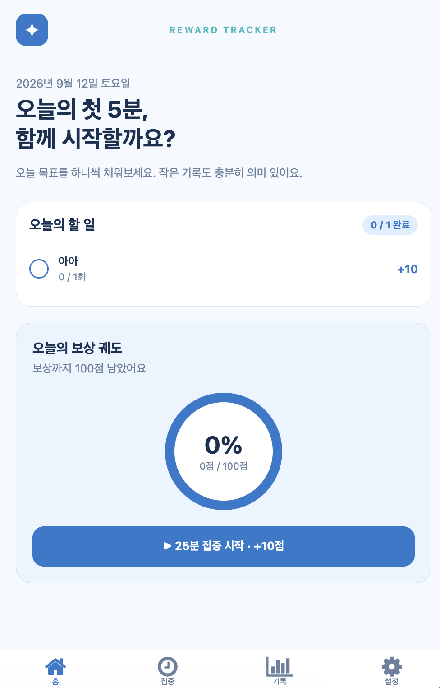

# Reward Tracker

> 작은 시작을 기록하고, 꾸준함을 보상으로 바꾸는 개인용 취업 준비 트래커

<p align="center">
  
</p>

매일의 취업 준비는 해야 할 일이 많아서 시작하기 어려울 때가 있습니다. **Reward Tracker**는 할 일 완료와 집중 시간을 점수로 쌓고, 목표 달성까지의 진행도를 한눈에 보여 주는 개인용 웹·모바일 앱입니다. “오늘 첫 5분”처럼 부담 없는 행동부터 시작할 수 있도록 설계했습니다.

## 이런 분께 잘 맞아요

- 취업 준비 루틴을 매일 꾸준히 이어가고 싶은 분
- 공부·이력서·포트폴리오·지원 활동을 한곳에서 기록하고 싶은 분
- 체크리스트만으로는 동기부여가 부족해 작은 보상 구조가 필요한 분

## 핵심 기능

### 오늘의 할 일과 포인트

매일 반복할 할 일을 만들고 완료할 때마다 포인트를 받습니다. 집중 세션, 알고리즘 풀이, 이력서·포트폴리오 개선, 실제 지원처럼 나에게 맞는 목표를 관리할 수 있습니다. 하루 목표를 모두 끝내면 보너스 포인트도 받을 수 있습니다.

### 집중 타이머

기본 25분 집중과 5분 휴식 흐름을 제공합니다. 집중이 끝나면 기록과 포인트가 자동으로 반영되어, 해야 할 일을 시작하는 작은 계기를 만들어 줍니다.

### 보상 진행도와 기록

오늘·이번 주의 점수, 목표 완료율, 누적 완료 일수, 최근 기록을 확인할 수 있습니다. 일일·주간 목표를 달성하면 보상 메시지로 성취를 확인합니다.

### 기기 간 동기화와 알림

웹과 모바일 앱은 같은 데이터를 공유합니다. 집중 종료, 보상 달성, 그리고 오후 1시까지 첫 기록이 없을 때의 가벼운 알림을 지원합니다.

## 사용 흐름

1. 홈에서 오늘의 할 일과 보상 진행도를 확인합니다.
2. 할 일을 완료하거나 집중 타이머를 시작합니다.
3. 완료 기록과 포인트가 즉시 반영됩니다.
4. 오늘의 목표와 이번 주 보상까지 남은 거리를 확인합니다.

## 기술 구성

| 영역 | 사용 기술 |
| --- | --- |
| 앱·웹 | React Native, Expo, Expo Router, TypeScript, React Native Web |
| 서버 | Ruby on Rails API |
| 데이터베이스 | SQLite |
| 실시간 동기화 | REST API, Action Cable (WebSocket) |
| 알림 | Expo Notifications, Web Push |

## 프로젝트 구조

```text
.
├── frontend/       # Expo 기반 iOS·Android·웹 클라이언트
├── backend/        # Rails API, 데이터·포인트·보상 처리
├── docs/images/    # README 이미지
├── erd.md          # 데이터 모델(ERD) 설계
├── agent.md        # 제품 및 개발 설계 문서
└── design.md       # 화면 디자인 명세
```

## 로컬에서 실행하기

### 1. 백엔드 실행

Ruby와 Bundler가 준비되어 있어야 합니다.

```bash
cd backend
cp .env.example .env
bundle install
bin/rails db:prepare
bin/rails server
```

`.env`에는 배포 주소와 푸시 알림 키처럼 환경별 값만 보관하세요. 개인 키가 포함될 수 있으므로 Git에 올리지 않습니다.

### 2. 프론트엔드 실행

Node.js와 npm이 준비되어 있어야 합니다.

```bash
cd frontend
cp .env.example .env
npm install
npx expo start
```

웹으로 열려면 다음 명령을 사용합니다.

```bash
npx expo start --web
```

iPhone에서 테스트할 때는 `frontend/.env`의 `EXPO_PUBLIC_API_URL`에 컴퓨터의 `localhost`가 아닌, iPhone에서 접근 가능한 HTTPS API 주소를 설정해야 합니다. 자세한 내용은 [프론트엔드 실행 안내](frontend/README.md)를 참고하세요.

## 설계 원칙

- **개인 중심**: 회원가입·랭킹·공유 없이 한 사람의 루틴에 집중합니다.
- **작은 시작**: 실패를 벌주기보다 오늘 할 수 있는 작은 행동을 돕습니다.
- **신뢰할 수 있는 기록**: 점수와 보상 계산은 서버에서 처리해 중복 기록을 방지합니다.
- **어디서나 이어서**: 웹과 모바일에서 같은 진행 상황을 확인합니다.

## 문서

- [제품·개발 설계](agent.md)
- [데이터 모델(ERD)](erd.md)
- [화면 디자인 명세](design.md)
- [백엔드 안내](backend/README.md)

## 라이선스

현재 라이선스는 정해지지 않았습니다. 공개 배포 전에는 프로젝트 목적에 맞는 라이선스를 추가해 주세요.
