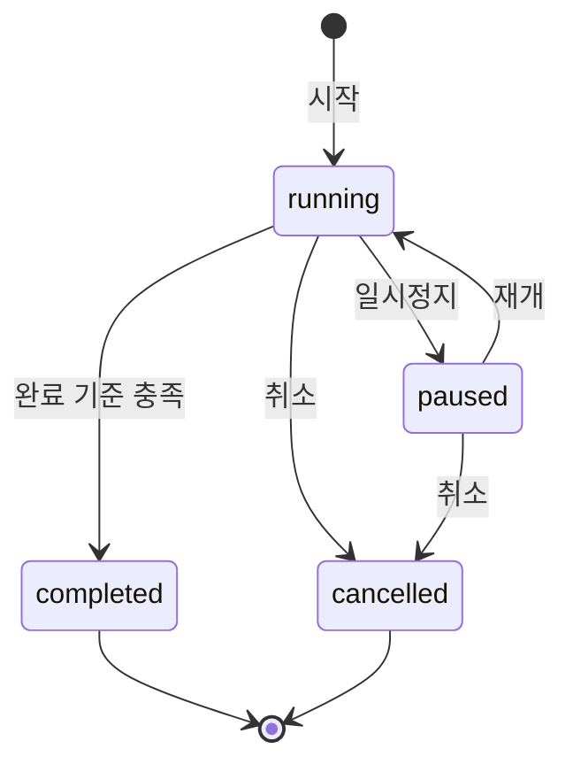

# 집중 타이머 백엔드 설계

## 태스크 목표

웹·앱 중 어느 기기에서 시작해도 현재 타이머 상태를 복구하고, 정상 완료 시에만 집중 포인트를 한 번 지급한다. 초 단위 카운트다운과 종료 알림은 기기에서 처리하며, Rails는 기록·동기화·점수의 기준점이 된다.

## 이번 태스크의 범위

- 집중 세션 시작, 일시정지, 재개, 완료, 취소
- 기기를 다시 열었을 때 서버 기록으로 남은 시간 복구
- 완료 조건 판정과 `point_events` 원장 기록
- 한 사람에게 동시에 하나의 실행/일시정지 타이머만 허용

## 범위 밖

- 휴식 타이머 자동 시작
- 타이머 종료 시 서버 푸시 발송 (앱 로컬 알림으로 처리)
- 세션별 목표/메모, 통계 화면
- 오프라인 상태에서 타이머를 시작하거나 완료 처리

## 책임 분리

| 구분 | 클라이언트(React Native/Web) | 서버(Rails) |
| --- | --- | --- |
| 남은 시간 표시 | 단조 시계로 매초 계산 | 계산하지 않음 |
| 종료 알림 | 시작 시 로컬 알림 예약, 완료/취소 시 해제 | 발송하지 않음 |
| 타이머 상태 | 화면 상태와 즉시 반응 | 영속 상태의 기준 |
| 포인트 | 표시만 함 | 완료 조건 판정·원장 기록 |
| 기기 전환 | 서버 상태를 다시 받아 화면 복구 | 활성 세션을 하나로 제한 |

## 데이터 변경

### 새 테이블: `focus_sessions`

| 필드 | 설명 |
| --- | --- |
| `id` | UUID 문자열 기본키 |
| `source_device_id` | 최초 시작 기기 FK |
| `started_at` | 서버가 수락한 시작 시각 (UTC) |
| `planned_seconds` | 집중 예정 시간. 기본 1,500초(25분) |
| `status` | `running`, `paused`, `completed`, `cancelled` |
| `kind` | `focus` 또는 `break`. `break`는 휴식 타이머로 완료해도 포인트·할 일 완료를 만들지 않고, 집중 시간 통계에도 포함하지 않는다 |
| `paused_at` | 현재 일시정지 시작 시각, 아닐 때 null |
| `paused_seconds` | 누적 일시정지 시간 |
| `ended_at` | 완료/취소 시각 |
| `completed_seconds` | 일시정지를 뺀 실제 집중 시간 |
| `active_lock` | `running`/`paused`일 때 1, 나머지는 null |
| `created_at`, `updated_at` | Rails 표준 시각 |

제약 조건:

- `planned_seconds`는 60~7,200초.
- `paused_seconds >= 0`, `completed_seconds >= 0`.
- `active_lock = 1`인 행에는 unique partial index를 둔다. 즉, 모든 기기를 합쳐 활성 세션은 하나뿐이다.
- `status = paused`이면 `paused_at`이 있어야 하고, `running`이면 null이어야 한다.

### 기존 `point_events` 확장

| 필드 | 변경 |
| --- | --- |
| `focus_session_id` | nullable FK 추가 |
| `event_type` | `focus_completion` 허용 |

- `daily_task_completion_id`와 `focus_session_id`는 동시에 값이 있을 수 없다.
- 완료 세션당 `focus_completion` 원장 이벤트는 하나뿐이다.
- 집중 포인트 기본값은 10점이며, Settings 구현 전까지 서버 상수 `FOCUS_COMPLETION_POINTS = 10`으로 둔다.

## 상태 전이



- `completed`, `cancelled`은 종료 상태다. 다시 실행할 수 없으며 새 세션을 만든다.
- `paused` 상태에서도 다른 기기에서 현재 타이머를 조회·재개할 수 있다.

## API 계약

모든 경로에는 기기 인증이 필요하다. 변경 요청은 `Idempotency-Key`를 요구한다.

| 메서드 | 경로 | 요청 | 성공 응답 |
| --- | --- | --- |
| GET | `/api/v1/focus-sessions/current` | - | 활성 세션 또는 `null` |
| POST | `/api/v1/focus-sessions` | `planned_seconds`, `kind`(`focus`/`break`, 기본 `focus`) | 생성된 `running` 세션 |
| PATCH | `/api/v1/focus-sessions/:id/pause` | - | `paused` 세션 |
| PATCH | `/api/v1/focus-sessions/:id/resume` | - | `running` 세션 |
| PATCH | `/api/v1/focus-sessions/:id/complete` | `ended_at` | 세션, 점수 이벤트, 일일 요약 |
| PATCH | `/api/v1/focus-sessions/:id/cancel` | - | `cancelled` 세션 |

### 상태 복구 응답 예시

```json
{
  "data": {
    "id": "0adce4f2-7eeb-4ef2-aab3-0e5b9b7249ae",
    "status": "running",
    "started_at": "2026-09-11T04:00:00Z",
    "planned_seconds": 1500,
    "paused_seconds": 120,
    "server_time": "2026-09-11T04:12:00Z"
  }
}
```

클라이언트는 `planned_seconds - (server_time - started_at - paused_seconds)`를 기준으로 처음 남은 시간을 잡고, 이후에는 기기 단조 시계로 계속 계산한다.

## 핵심 서비스

### `FocusSessions::Start`

1. `planned_seconds` 범위를 검증한다.
2. 트랜잭션에서 활성 세션을 잠그고, 있으면 `409 active_focus_session_exists`를 반환한다.
3. `focus_sessions`를 `running`, `active_lock: 1`로 생성한다.
4. 오늘 `daily_summaries.first_activity_at`이 비어 있으면 현재 시각을 기록한다. 포인트는 아직 주지 않는다.
5. 기기는 성공 응답을 받은 뒤 타이머 종료 로컬 알림을 예약한다.

### `FocusSessions::Pause` / `Resume`

- Pause: `running`일 때만 `status: paused`, `paused_at: now`로 바꾼다.
- Resume: `paused`일 때만 `paused_seconds += now - paused_at`, `paused_at: nil`, `status: running`으로 바꾼다.
- 잘못된 상태 전이는 `409 invalid_focus_session_state`다.

### `FocusSessions::Complete`

1. 서버 시각 기준으로 `completed_seconds = ended_at - started_at - paused_seconds`를 계산한다.
2. `ended_at`은 서버 현재 시각보다 60초 이상 미래일 수 없다.
3. `completed_seconds >= planned_seconds × 0.8`일 때만 완료로 인정한다.
4. 세션을 `completed`, `active_lock: null`로 갱신한다.
5. `PointEvent(event_type: focus_completion, points: 10)`을 unique하게 만든다.
6. 일일 요약과 보상 달성 여부를 다시 계산한다.
7. 앱은 예약한 로컬 알림을 해제하고 완료 화면을 보여준다.

### `FocusSessions::AutoComplete` (`FinalizeFocusSessionJob`)

- 세션 시작·재개 시 `scheduled_end_at`(=`started_at + planned_seconds + paused_seconds`)에 잡을 예약한다.
- 잡 실행 시 세션이 `running`이고 종료 시각이 지났으면 `ended_at = scheduled_end_at`으로 `Complete`를 호출해 자동 완료한다(멱등 키 `auto-complete-<세션 id>`).
- 앱이 열려 있으면 클라이언트도 남은 시간 0에 도달하는 즉시 `complete`를 호출한다. 먼저 성공한 쪽만 기록되고 나머지는 replay가 된다.
- 완료 후 `focus.completed` 실시간 이벤트를 발행하고 보상 알림 잡을 큐에 넣는다.
- 시작 기기에 Expo 사일런트 푸시(`_contentAvailable`, `type: focus_live_activity_end`)를 보내 잠금 상태에서도 Live Activity를 종료한다. 이미 끝난 세션에 대해서도 한 번 발송해 다른 기기에서 완료/취소된 잔여 Live Activity를 정리한다. `notification_deliveries`의 unique 제약으로 세션당 한 번만 발송된다.
- `paused` 세션은 완료도 푸시도 하지 않는다. 재개 시 새 종료 시각으로 잡이 다시 예약된다.

### `FocusSessions::Cancel`

- 활성 세션을 `cancelled`, `active_lock: null`로 바꾸고 점수는 기록하지 않는다.
- 앱은 예약한 로컬 알림을 해제한다.

## 오류 코드

| 코드 | HTTP | 뜻 |
| --- | ---: | --- |
| `active_focus_session_exists` | 409 | 다른 기기 포함 활성 세션이 있음 |
| `invalid_focus_session_state` | 409 | 현재 상태에서 허용되지 않는 요청 |
| `focus_session_not_found` | 404 | 세션을 찾을 수 없음 |
| `focus_session_too_short` | 422 | 예정 시간의 80% 미만 |
| `invalid_planned_seconds` | 422 | 집중 시간이 허용 범위 밖 |
| `invalid_ended_at` | 422 | 미래 시각 또는 시작 전 종료 |

## 구현 후 검증 항목

- 두 기기에서 동시에 시작하면 하나만 성공한다.
- 25분 세션의 20분 미만 완료는 점수를 주지 않는다.
- 같은 완료 요청 키를 재전송해도 포인트 이벤트가 한 번만 생긴다.
- Pause → Resume 후 실제 집중 시간에서 일시정지 시간이 제외된다.
- 취소 후 즉시 새 세션을 시작할 수 있다.
- 시작만 하고 완료하지 않아도 당일 13시 재촉 대상에서는 빠진다.
