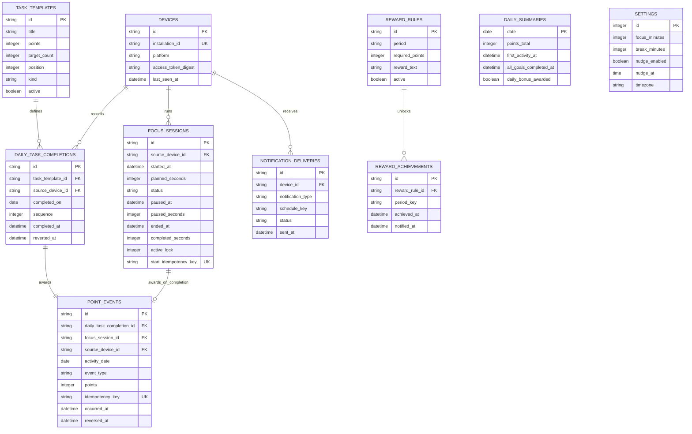

# 취준 리워드 트래커 ERD (MVP)

## 설계 원칙

- `point_events`가 점수의 원장이다. 점수를 다시 계산하거나 취소해도 기록의 이유와 당시 점수가 사라지지 않는다.
- `daily_summaries`는 화면 속도를 위한 날짜별 집계 캐시이며, 다른 테이블을 참조하는 원본 데이터가 아니다.
- 모든 일자(`completed_on`, `activity_date`, `daily_summaries.date`)는 `Asia/Seoul`을 기준으로 저장한다. 시각은 UTC로 저장한다.
- `settings`는 개인 1인 서비스이므로 단일 행만 유지한다.

## 필수 제약 조건

| 테이블 | 제약 |
| --- | --- |
| `devices` | `installation_id` unique |
| `daily_task_completions` | `(task_template_id, completed_on, sequence)` unique |
| `focus_sessions` | 활성 상태 행은 최대 하나; `start_idempotency_key` unique |
| `point_events` | `idempotency_key` unique; `daily_task_completion_id`와 `focus_session_id` 중 최대 하나만 값 허용 |
| `reward_achievements` | `(reward_rule_id, period_key)` unique |
| `notification_deliveries` | `(device_id, notification_type, schedule_key)` unique |
| `settings` | `id = 1`만 허용 |
